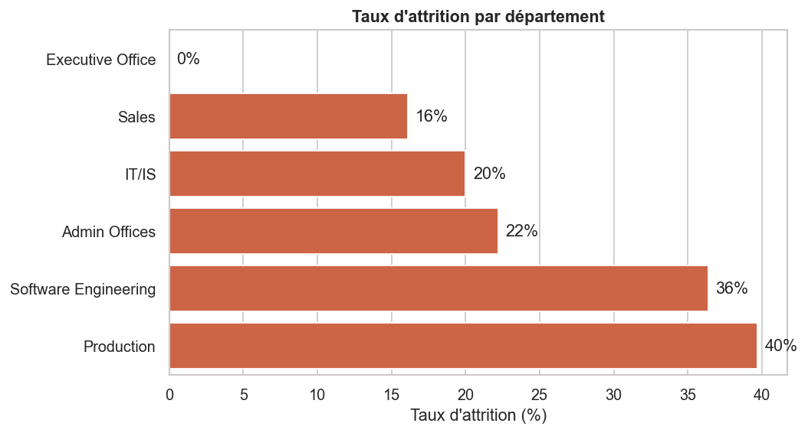
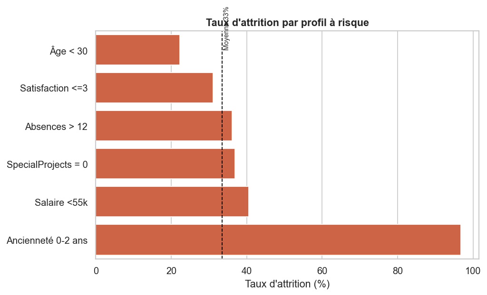

# 📊 Dashboard RH — Analyse des employés (People Analytics)

Projet de **Business Intelligence / People Analytics** end-to-end : nettoyage Python,
modélisation SQL, KPI RH et dashboard Power BI, à partir d'un jeu de données RH réel de 311 employés.
Objectif : comprendre **pourquoi les employés partent**, identifier les **profils à risque** et
proposer des **leviers de rétention** actionnables.


---

## 🎯 Problématique

> Le taux de rotation historique atteint **33 %**. Quels départements, profils et facteurs
> expliquent ces départs, et comment réduire l'attrition ?

L'analyse répond à 6 questions : causes du turnover, absentéisme, satisfaction, performance,
profils à risque et opportunités de rétention.

---

## 🗂️ Source de données

[HR Dataset (rhuebner) — Kaggle](https://www.kaggle.com/datasets/rhuebner/human-resources-data-set)
· `HRDataset_v14.csv` · 311 employés · 36 variables.

> ⚠️ **Adaptation du schéma.** Le brief listait des colonnes du dataset *IBM HR Analytics*
> (`WorkLifeBalance`, `OverTime`, `DistanceFromHome`, `Education`) qui **n'existent pas** dans ce
> dataset. L'analyse a été adaptée aux variables réellement disponibles :

| Concept demandé | Variable utilisée | Statut |
|---|---|---|
| Attrition | `Termd`, `EmploymentStatus`, `TermReason` | ✅ |
| Âge / Ancienneté | dérivés de `DOB` / `DateofHire` | ✅ calculés |
| Revenu | `Salary` (annuel) → `MonthlyIncome` | ✅ |
| Satisfaction | `EmpSatisfaction` (1-5), `EngagementSurvey` | ✅ |
| Performance | `PerformanceScore`, `PerfScoreID` | ✅ |
| Absentéisme | `Absences`, `DaysLateLast30` | ✅ |
| Heures sup. | `SpecialProjectsCount` (proxy d'implication) | ⚠️ proxy |
| WorkLifeBalance / DistanceFromHome / Education | — | ❌ absents |

---

## 📁 Structure du projet

```
BI2/
├── data/
│   ├── HRDataset_v14.csv          # données brutes (Kaggle)
│   └── processed/
│       ├── hr_clean.csv           # données nettoyées (source SQL & Power BI)
│       └── kpis.csv               # KPI exportés
├── notebooks/
│   └── 01_hr_analysis.ipynb       # nettoyage + EDA + analyse (avec sorties)
├── scripts/
│   ├── clean_data.py              # pipeline de nettoyage + génération des figures
│   ├── build_notebook.py          # (re)génère et exécute le notebook
│   └── build_report_pdf.py        # génère le rapport PDF
├── sql/
│   ├── 01_schema.sql              # CREATE TABLE employees (PostgreSQL)
│   ├── 02_load.sql                # chargement \copy
│   ├── 03_kpis.sql                # requêtes KPI
│   └── 04_analysis.sql            # requêtes d'analyse (turnover, facteurs, risque)
├── powerbi/
│   ├── DAX_measures.md            # toutes les mesures DAX
│   └── PowerBI_build_guide.md     # guide de construction pas-à-pas
├── reports/
│   ├── figures/                   # 11 graphiques PNG
│   ├── HR_Analytics_Report.md     # rapport synthétique
│   └── HR_Analytics_Report.pdf    # rapport PDF (9 pages)
├── requirements.txt
└── README.md
```

---

## 📈 KPI RH principaux

| Indicateur | Valeur |
|---|---|
| Effectif total | **311** (207 actifs) |
| Taux d'attrition (cumulé) | **33,4 %** |
| Taux d'absentéisme (proxy) | 3,9 % |
| Satisfaction moyenne | 3,89 / 5 |
| Performance moyenne | 11,9 % de hauts performeurs |
| Ancienneté moyenne | 5,4 ans |
| Salaire annuel moyen | 69 021 $ |

---

## 🔍 Principaux insights

1. **L'ancienneté est le signal n°1** — 96,8 % des départs surviennent dans les **2 premières années**
   (vs 2,6 % au-delà de 9 ans). Le risque se joue à l'**onboarding**.
2. **La Production concentre le turnover** (39,7 % d'attrition, 67 % de l'effectif).
3. **La source de recrutement est très discriminante** — Google Search (61 %) et Diversity Job Fair
   (55 %) produisent des recrues 7× moins stables que le site carrière (8 %).
4. **Le manager compte** — jusqu'à 62 % d'attrition dans certaines équipes à effectif comparable.
5. **L'implication retient** — 0 projet spécial = 37 % d'attrition vs 21 % avec ≥ 1 projet.
6. **Finding contre-intuitif** — la satisfaction déclarée **ne prédit quasiment pas** les départs
   (3,89 restés vs 3,88 partis). Les leviers sont structurels, pas déclaratifs.

<p align="center">
  
  
</p>

---

## 💡 Recommandations RH

1. **Sécuriser les 24 premiers mois** : onboarding structuré, parrainage, points 30/60/90 jours.
2. **Optimiser le sourcing** vers les canaux stables (cooptation, site carrière) ; auditer Google/Job Fair.
3. **Accompagner les managers** à forte attrition (Production).
4. **Développer l'implication** via des projets transverses (−15 pts d'attrition mesurés).
5. **Plans de carrière & équité salariale** pour les profils techniques et les bas salaires.

---

## ▶️ Reproduire le projet

```bash
# 1. Environnement
pip install -r requirements.txt

# 2. Nettoyage + KPI + figures
python scripts/clean_data.py

# 3. (Re)générer le notebook exécuté
python scripts/build_notebook.py

# 4. Générer le rapport PDF
python scripts/build_report_pdf.py
```

**SQL (PostgreSQL)**
```bash
psql -d hr -f sql/01_schema.sql
psql -d hr -f sql/02_load.sql      # adapter le chemin du \copy
psql -d hr -f sql/03_kpis.sql
psql -d hr -f sql/04_analysis.sql
```

**Power BI** — importer `data/processed/hr_clean.csv`, créer les mesures de
[`powerbi/DAX_measures.md`](powerbi/DAX_measures.md) et suivre
[`powerbi/PowerBI_build_guide.md`](powerbi/PowerBI_build_guide.md).

---

## 🛠️ Compétences démontrées

`People Analytics` · `Python (Pandas, NumPy, Matplotlib, Seaborn)` · `SQL (PostgreSQL)` ·
`Power BI / DAX` · `Data Cleaning` · `Data Visualization` · `KPI RH` · `Analyse décisionnelle`

---

## 📌 Limites & honnêteté méthodologique

- Le taux d'attrition de 33 % est **cumulé** (historique complet), pas annualisé.
- La relation ancienneté↔attrition est en partie **mécanique** (les partis cessent d'accumuler de l'ancienneté).
- `SpecialProjectsCount` est un **proxy** imparfait des heures supplémentaires.
- Échantillon modeste (311 employés) : les taux par sous-groupe sont indicatifs.
