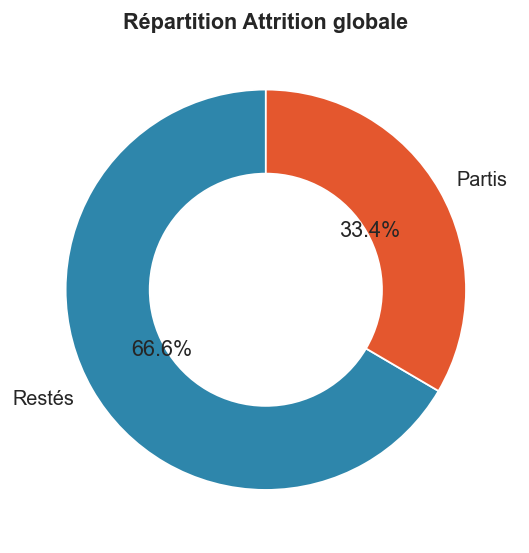
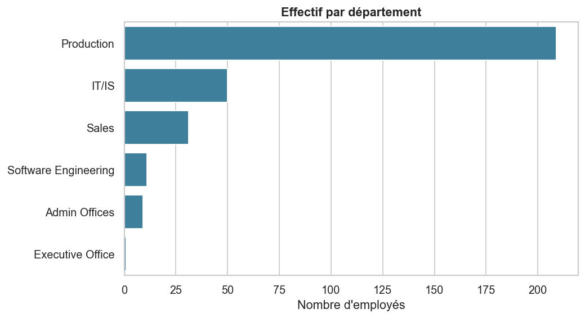
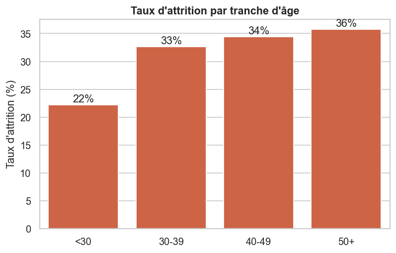
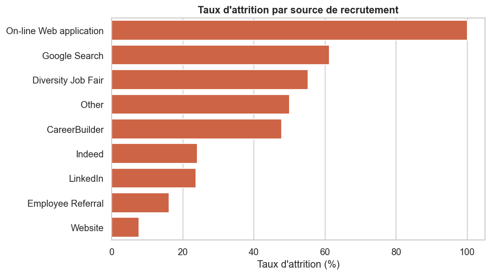
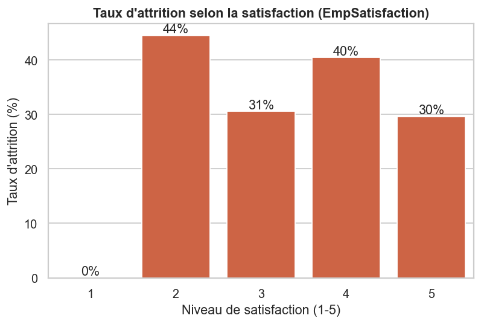
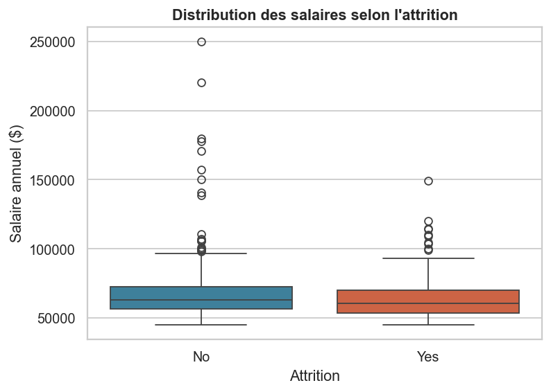
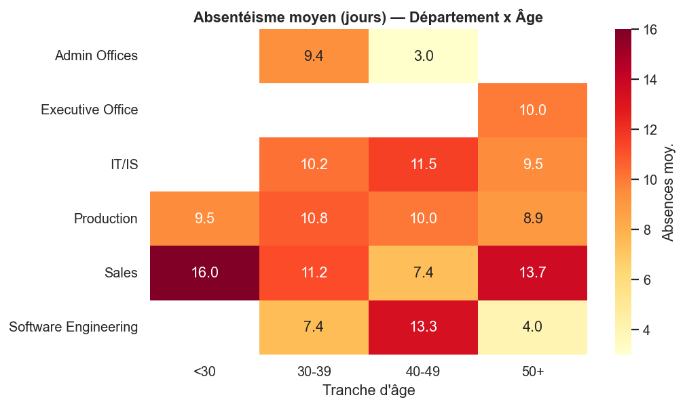
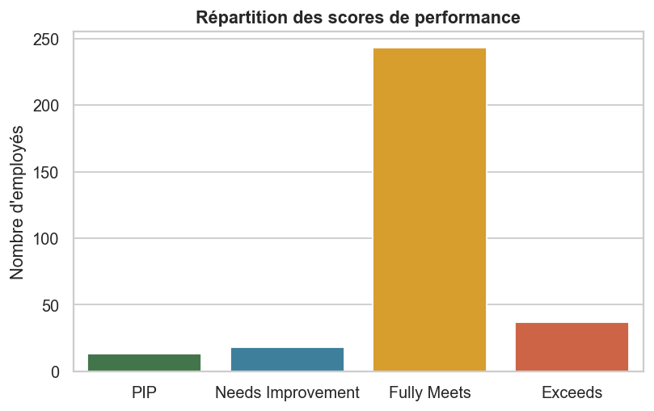

# Dashboard RH — Analyse des employés
### Rapport d'analyse People Analytics

**Dataset :** HRDataset_v14 (Kaggle) — 311 employés, 36 variables d'origine
**Période couverte :** recrutements 2006-2018, données arrêtées fin 2018/2019
**Auteur :** *Projet portfolio Data Analyst / BI Developer*

---

## 1. Contexte & objectifs

Cette étude analyse les données RH d'une entreprise (production majoritaire) afin de
comprendre les **causes du turnover**, l'**absentéisme**, la **satisfaction** et la
**performance**, puis d'identifier les **profils à risque** et des **leviers de rétention**.

> **Note sur les données.** Le brief initial listait des colonnes du dataset *IBM HR Analytics*
> (WorkLifeBalance, OverTime, DistanceFromHome, Education). Le dataset réellement fourni (rhuebner)
> a un schéma différent. L'analyse a été **adaptée aux variables réellement disponibles** :
> attrition via `Termd`/`TermReason`, salaire, satisfaction (`EmpSatisfaction`), engagement
> (`EngagementSurvey`), performance (`PerformanceScore`), absentéisme (`Absences`), et
> `SpecialProjectsCount` comme proxy d'implication (à défaut d'heures supplémentaires).

---

## 2. KPI RH clés

| Indicateur | Valeur |
|---|---|
| Effectif total | **311** |
| Effectif actif | 207 |
| Départs (cumulés) | 104 |
| **Taux d'attrition** | **33,4 %** |
| Taux d'attrition volontaire | 28,3 % |
| Taux d'absentéisme (proxy /261 j) | 3,9 % |
| Absences moyennes | 10,2 jours |
| Satisfaction moyenne | 3,89 / 5 |
| Engagement moyen | 4,11 / 5 |
| % hauts performeurs | 11,9 % |
| Ancienneté moyenne | 5,4 ans |
| Salaire annuel moyen | 69 021 $ |
| Âge moyen | 40,9 ans |

> ⚠️ Le taux d'attrition de 33 % est **cumulé sur toute l'historique** du dataset (et non annuel) :
> il agrège tous les départs jamais survenus. Il doit se lire comme un taux de rotation historique,
> non comme un taux annualisé.

---

## 3. Où se concentre le turnover ?

### 3.1 Par département
La **Production** (209 employés, 67 % de l'effectif) affiche le taux d'attrition le plus élevé
(**39,7 %**), suivie de **Software Engineering** (36,4 %). Les fonctions support (Sales 16 %,
IT/IS 20 %) sont nettement plus stables.

### 3.2 Par ancienneté — le signal le plus fort
Les départs sont **massivement précoces** : **96,8 %** des employés de **0-2 ans** ont quitté
l'entreprise, contre 50 % à 3-5 ans, 16,8 % à 6-8 ans et seulement **2,6 % au-delà de 9 ans**.

| Ancienneté | Effectif | Taux d'attrition |
|---|---|---|
| 0-2 ans | 31 | **96,8 %** |
| 3-5 ans | 98 | 50,0 % |
| 6-8 ans | 143 | 16,8 % |
| 9+ ans | 39 | 2,6 % |

> *Lecture méthodologique : la relation est en partie mécanique (un employé parti cesse d'accumuler
> de l'ancienneté). Elle confirme néanmoins que **le risque de départ se joue dans les 2 premières
> années** — fenêtre critique pour l'onboarding et la fidélisation.*

### 3.3 Par tranche d'âge
L'attrition est relativement homogène entre 30 et 50+ ans (33-36 %) et plus faible chez les
moins de 30 ans (22 %, faible effectif).

---

## 4. Quels facteurs expliquent les départs ?

### 4.1 Source de recrutement — prédicteur majeur
C'est l'un des facteurs les plus discriminants : les recrues issues de **Google Search (61 %)**
et **Diversity Job Fair (55 %)** partent beaucoup plus que celles venant du **site carrière (8 %)**
ou de la **cooptation / Employee Referral (16 %)**.

### 4.2 Manager
À effectif comparable (≥ 8 collaborateurs), le taux d'attrition varie de **62 %**
(Amy Dunn, Webster Butler) à ~35 % selon le manager — un facteur organisationnel fort,
concentré sur les équipes de Production.

### 4.3 Implication (projets spéciaux)
Les employés **sans aucun projet spécial** partent davantage (**36,9 %**) que ceux impliqués
dans au moins un projet (**21,4 %**). L'implication transverse apparaît comme un facteur de rétention.

### 4.4 Satisfaction & engagement — un résultat contre-intuitif
Dans ce dataset, la **satisfaction déclarée ne discrimine quasiment pas** les partants
(satisfaction moyenne 3,89 chez les restés vs 3,88 chez les partis ; engagement 4,12 vs 4,09).
La relation satisfaction → attrition est **non monotone**. Les leviers réels sont structurels
(recrutement, manager, ancienneté) plutôt que déclaratifs.

### 4.5 Salaire
Les partants gagnent en moyenne **~5 000 $ de moins** (65 690 $ vs 70 694 $) — facteur réel
mais secondaire par rapport au recrutement et à l'ancienneté.

### 4.6 Synthèse des profils à risque

| Profil | Taux d'attrition |
|---|---|
| Ancienneté 0-2 ans | 96,8 % |
| Recrutement Google / Job Fair | ~58 % |
| Département Production | 39,7 % |
| 0 projet spécial | 36,9 % |
| Salaire < 55k | ~elevé |
| *Moyenne entreprise* | *33,4 %* |

---

## 5. Absentéisme & performance

L'absentéisme moyen (10,2 jours) est relativement homogène entre départements et tranches d'âge,
sans concentration marquée. Les partants sont légèrement plus absents (11,0 vs 9,8 jours).

Côté performance, **78 %** des employés sont « Fully Meets », 12 % « Exceeds », et **10 %**
en difficulté (PIP / Needs Improvement) — population cible d'un accompagnement managérial.

---

## 6. Recommandations RH

1. **Sécuriser les 24 premiers mois** — c'est là que se joue l'essentiel du turnover.
   Parcours d'onboarding structuré, parrainage, points à 30/60/90 jours et à 6/12/18 mois.
2. **Optimiser le sourcing** — réorienter le recrutement vers les canaux les plus stables
   (cooptation, site carrière) ; auditer la qualité des recrutements Google Search / Job Fair
   (adéquation poste, attentes, intégration).
3. **Accompagner les managers à forte attrition** (Production) — formation au management,
   suivi des équipes, allègement de charge, feedback régulier.
4. **Développer l'implication** — proposer systématiquement des projets transverses
   (effet rétention mesuré : -15 pts d'attrition).
5. **Plans de carrière & mobilité** pour les profils techniques (Software Engineering),
   et revue de l'équité salariale sur les tranches basses (< 55k).
6. **Mettre sous surveillance les profils actifs à risque** (cf. mesure *Employés à Risque*
   du dashboard) pour des actions de rétention ciblées.

---

## 7. Livrables du projet

| Livrable | Fichier |
|---|---|
| Notebook d'analyse & nettoyage | `notebooks/01_hr_analysis.ipynb` |
| Script de nettoyage Python | `scripts/clean_data.py` |
| Scripts SQL (schéma, KPI, analyse) | `sql/01..04_*.sql` |
| Données nettoyées | `data/processed/hr_clean.csv` |
| Mesures DAX & guide Power BI | `powerbi/` |
| Rapport synthétique | `reports/HR_Analytics_Report.(md\|pdf)` |

---

*Compétences démontrées : People Analytics · Python (Pandas, Matplotlib, Seaborn) · SQL (PostgreSQL) ·
Power BI / DAX · Data Visualization · KPI RH · Analyse décisionnelle.*
